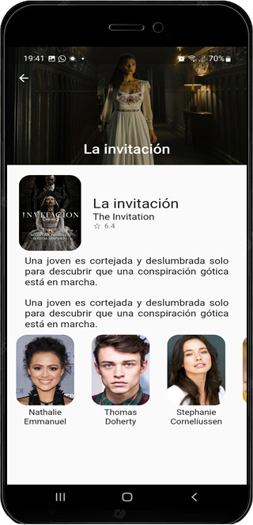

# Películas App - Flutter UI 

Aplicación catálogo de películas puede ejecutar dispositivos Android e iOS porque se construye con flutter.

## ScreenShots 
### Home Page

Muestra catálogo de peliculas, al hacer click muestra información detallada de pelicula

### Busqueda

Buscapeliculas por nombre

### Detalle Película Page

Muestra catálogo de peliculas

&nbsp;&nbsp;&nbsp;&nbsp;&nbsp;&nbsp;&nbsp;&nbsp;
